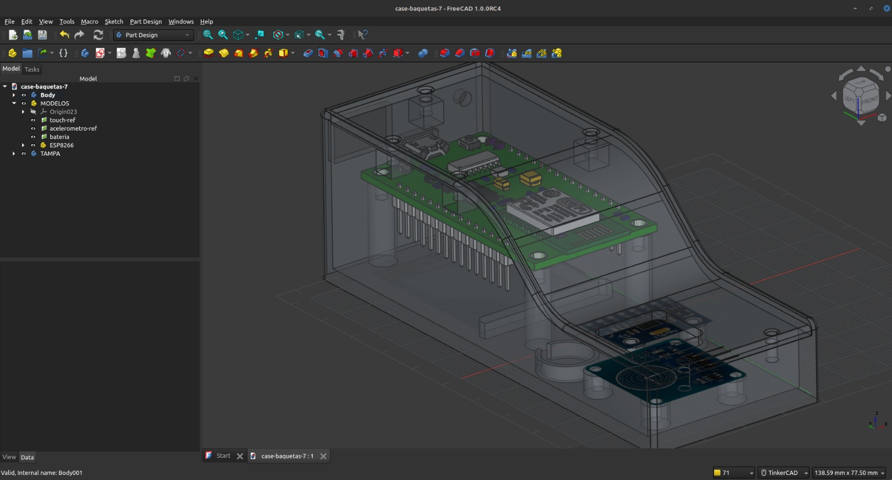
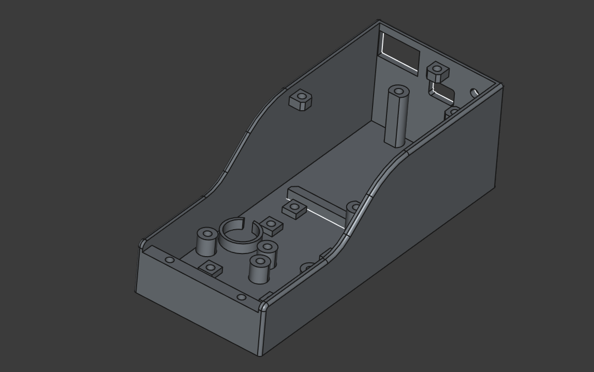
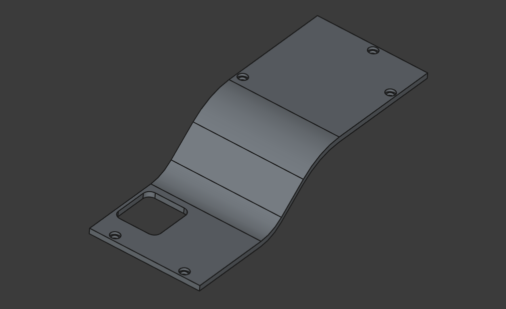
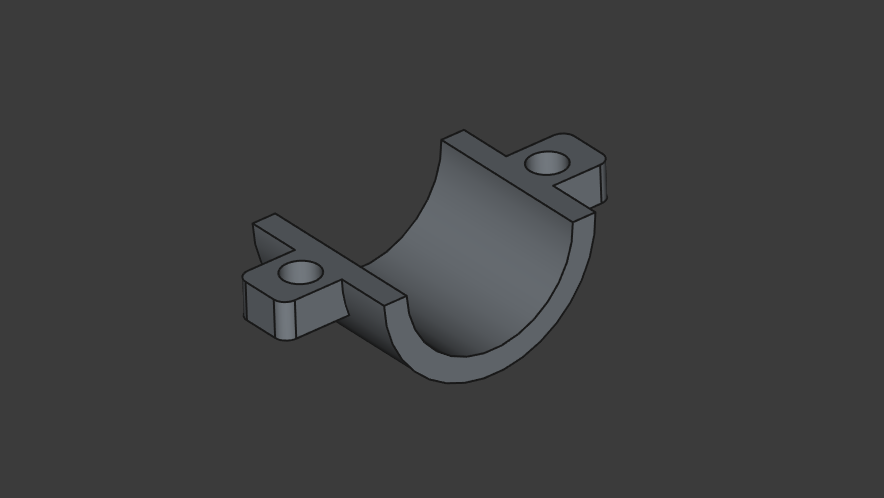
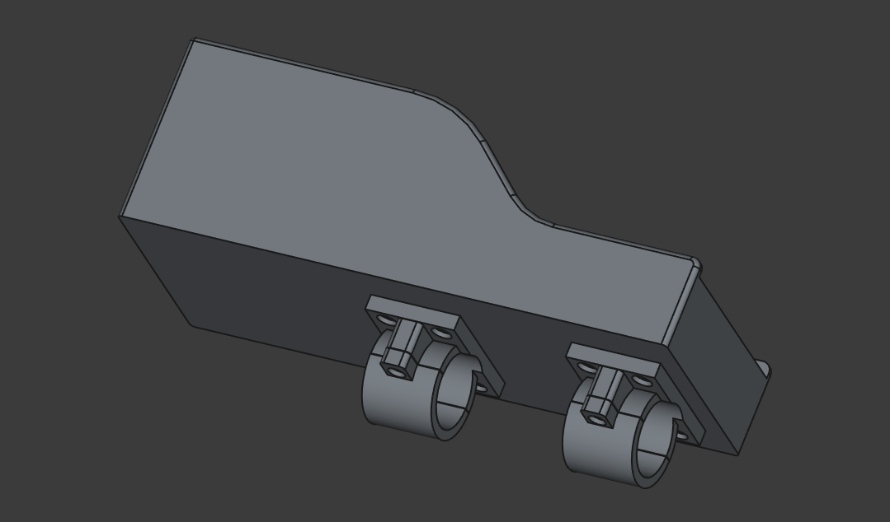
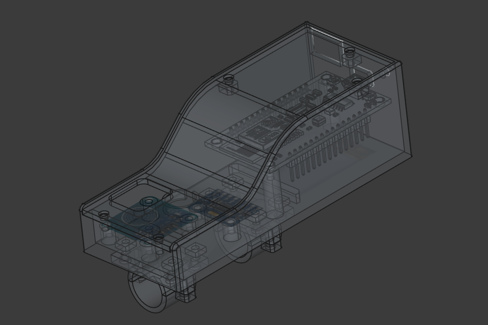

# PHIGITAL Case Project

These files belong to Rômulo Vieira's doctoral project (Fluminense Federal University - UFF).

Next, some images of the 3D project and physical objects resulting from 3D printing using PLA are presented.

The drumstick case design was all done in FreeCAD software and the pedals case was done in TinkerCAD software. The prints were made on a Creality Ender3 V3 printer using Creality's own slicing software.

 

   

   

   

   

   

   

   

   

   

   

